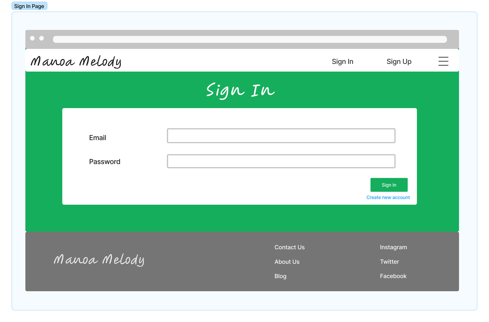

# Manoa Melody

## Table of contents

* [Overview](#overview)
* [Mockup Pages](#mockup pages)

## Overview
Manoa Melody hopes to resolve an ongoing issue that many UH students with musical talents have been facing – being able to connect with other students who share the same musical tastes, talents, and capabilities. 

There are many ways for students to connect and start a friendship with others. Having similar musical interests is one of them. This application will also cater to these students that want to find friends of similar music tastes. Not only that, it can also help small artists be discovered and gain a platform. 

### Goals of What the System Will Provide
* Create a functional application that allows UH Manoa musicians to network with other fellow musicians
* Allows UH Manoa students to connect with other students based on their musical interests
* Promotes musical events held by the UH Manoa community

## Mockup Pages

### Landing Page
When first opening the application,the landing page will appear with an introduction of what Manoa Melody is:

### Sign Up Page
If someone does not have an account with Manoa Melody, they may click on the Sign Up link in the NavBar and be redirected to the Sign Up page, where they may register:

### Edit Profile Page
After registering for an account, the user will be prompted to the Edit Profile page, where they must create a profile, consisting of their picture, name, and a description.

### Sign In Page
If someone is already registered for Manoa Melody, they may click on the Sign In link and be redirected the Sign In page:

### User Home Page
After successfully logging in, the user will be redirected to the Home Page, where the NavBar has been updated with additional links to more pages:

### Add Events Page
Users who would like to advertise their events (jam sessions, live concerts, etc.) with others on the application may click on the Add Events link and fill out the form with pertinent information about the event. After filling out and submitting the form, the event will be shown in the Events page.

### Events Page
Users can explore events that are being hosted by the University and students by clicking on the Events Page link on the NavBar.  
