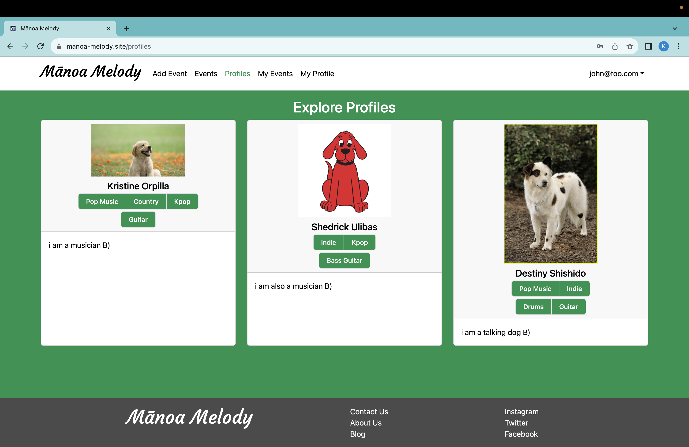
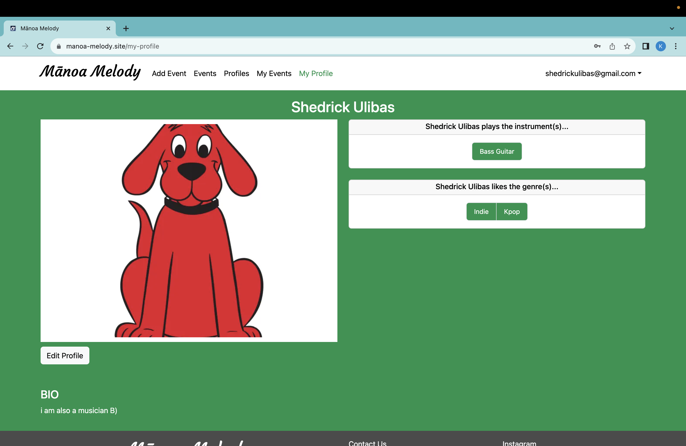
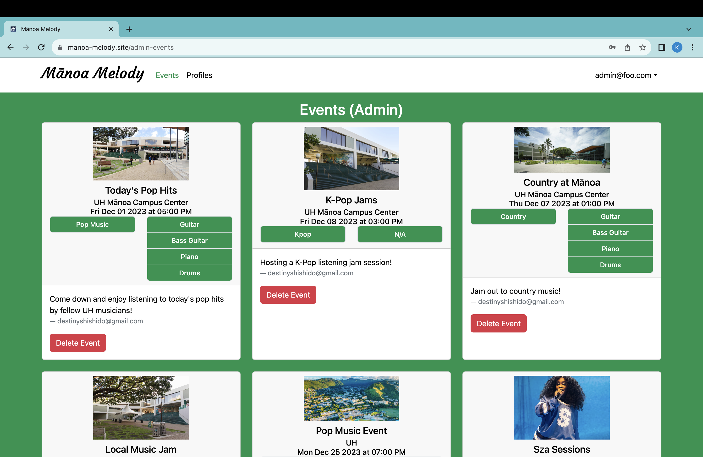
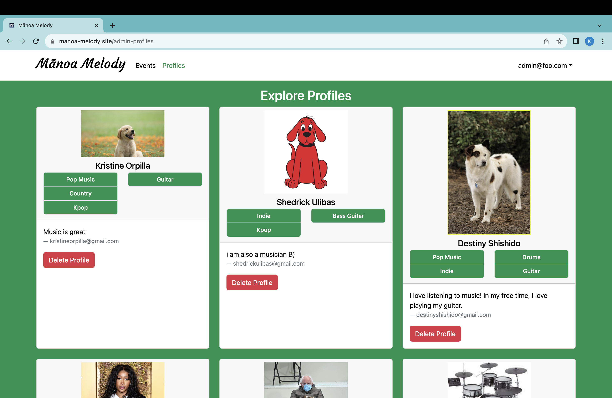

## Table of contents

* [Overview](#overview)
* [Links](#links)
* [Badge](#badge)
* [Developer Guide](#developer-guide)
* [User Guide](#user-guide)
* [Team Members](#team-members)

## Overview
Mānoa Melody hopes to resolve an ongoing issue that many UH students with musical talents have been facing – being able to connect with other students who share the same musical tastes, talents, and capabilities. 

There are many ways for students to connect and start a friendship with others. Having similar musical interests is one of them. This application will also cater to these students that want to find friends of similar music tastes. Not only that, it can also help small artists be discovered and gain a platform. 

### Goals of What the System Will Provide
* Create a functional application that allows UH Mānoa musicians to network with other fellow musicians
* Allow UH Mānoa students to connect with other students based on their musical interests
* Promote musical events held by the UH Mānoa community

## Links
* [GitHub Organization](https://github.com/manoa-melody)
* [Digital Ocean Deployment Link](https://manoa-melody.site)
* [Team Contract](https://docs.google.com/document/d/1GudA4xZf2mPfy_P2KJ5WNL01QBL8tX7OjxNeBdaGfr0/edit?usp=sharing)
* [M1 Project Board](https://github.com/orgs/manoa-melody/projects/1)
* [M2 Project Board](https://github.com/orgs/manoa-melody/projects/2)
* [M3 Project Board](https://github.com/orgs/manoa-melody/projects/3/views/1)

# Badge
[](https://github.com/manoa-melody/manoa-melody/actions/workflows/ci.yml)

## Developer Guide

First, [install Meteor](https://www.meteor.com/install).

Second, go to [https://github.com/manoa-melody/manoa-melody](https://github.com/manoa-melody/manoa-melody), and download a copy of Mānoa Melody.

Then, cd into the app/ directory of your local copy of the repo, and install third party libraries with:

```
$ meteor npm install
```

Once the libraries are installed, you can run the application by invoking:

```
$ meteor npm run start
```

The first time you run the app, it will create some default users and data. Here is the output:

```
meteor npm run start

> meteor-application-template-react@ start /Users/kristineorpilla/Desktop/GitHub/manoa-melody/app
> meteor --no-release-check --exclude-archs web.browser.legacy,web.cordova --settings ../config/settings.development.json

[[[[[ ~/Desktop/GitHub/manoa-melody/app ]]]]] 

=> Started proxy.                             
=> Started HMR server.                        
=> Started MongoDB.                           
I20231129-17:44:37.778(-10)? Creating the default user(s)
I20231129-17:44:37.784(-10)?   Creating user admin@foo.com.
I20231129-17:44:38.170(-10)?   Creating user john@foo.com.
I20231129-17:44:38.258(-10)?   Creating user kristineorpilla@gmail.com.
I20231129-17:44:38.348(-10)?   Creating user shedrickulibas@gmail.com.
I20231129-17:44:38.404(-10)?   Creating user destinyshishido@gmail.com.
I20231129-17:44:38.468(-10)? Creating default profiles.
I20231129-17:44:38.468(-10)?   Adding: undefined undefined (kristineorpilla@gmail.com)
I20231129-17:44:38.492(-10)?   Adding: undefined undefined (shedrickulibas@gmail.com)
I20231129-17:44:38.492(-10)?   Adding: undefined undefined (destinyshishido@gmail.com)
I20231129-17:44:38.493(-10)? Creating default events.
I20231129-17:44:38.494(-10)?   Adding: Today's Pop Hits 2023-12-01T17:00:00.000Z
I20231129-17:44:38.514(-10)?   Adding: K-Pop Jams 2023-12-08T15:00:00.000Z
I20231129-17:44:38.515(-10)?   Adding: Country at Mānoa 2023-12-07T13:00:00.000Z
=> Started your app.

=> App running at: http://localhost:3000/
I20231129-17:44:39.150(-10)? Monti APM: Connected
```

If all goes well, the Mānoa Melody application will appear at [http://localhost:3000](http://localhost:3000).  You can login using the credentials in [settings.development.json](https://github.com/manoa-melody/manoa-melody/blob/main/config/settings.development.json), or else register a new account.

### ESLint

You can verify that the code obeys our coding standards by running ESLint over the code in the imports/ directory with:

```
$ meteor npm run lint
```


## User Guide
The application is deployed on [Digital Ocean](https://manoa-melody.site). Below are the up-to-date version of the application and the mockup pages that are still in-progress:

#### Landing Page
When first opening the application, the user is greeted by the landing page which gives an overview of Manoa Melody and the goals of the application:


### Sign Up Page
If the user does not have an account with Mānoa Melody, they can create one by clicking on the Sign Up link in the NavBar. They will be redirected to the Sign Up page, where they may register using an email and password:


### Set Up Profile Page
After registering for an account, the user will be prompted to the Set Up My Profile page, where they must create a profile. Profiles include a profile picture, display name, username, description, and their interests:


### Sign In Page
If someone is already registered for Manoa Melody, they may click on the Sign In link and be redirected the Sign In page:


### User Home Page
After successfully logging in, the user will be redirected to the Home page, where the NavBar has been updated with additional links to more pages:


### Add Event Page
Users who would like to advertise their events (jam sessions, live concerts, etc.) with others on the application may click on the Add Event link and fill out the form with pertinent information about the event. After filling out and submitting the form, the event will be shown in the Events page:


### Events Page
Users can explore events that are being hosted by the University and students by clicking on the Events page link on the NavBar.  In the Events page, they will be shown all events and their descriptions:


### Profiles Page
Users can explore other users on the application by clicking on the Profiles page link on the NavBar. The Profiles page will show users and their profiles. This page allows people to find student musicians and also students who share the same musical interests as them. Their profile includes their different social media profiles, where they can use to meet and network with others:


### My Events Page
To access the My Events page, the user may click on the My Events page link. This page showcases all events that were created by the user:


### My Profile Page
When clicking on the My Profile page link, they will be redirected to their My Profile page, where they can look over their profile and be given the option to edit it:


### Edit Profile Page
A person may edit their profile by clicking on the Edit button on the My Profile page, where they will be prompted to a form that displays their stored profile information. On this page, they may edit their profile and submit changes:


### Admin Home Page
If a user is assigned an “Admin” role, after logging in, their home page will include an updated NavBar similar to the user’s, but has a dropdown menu under Admin with access to two pages: Events and Profiles:


### Admin Events Page
The admin can click on the Admin Events page link in the dropdown menu of Admin on the NavBar, and will be redirected to the Admin Events page. This page showcases all the events posted by users, and allows the admin to remove any events that are inappropriate for users:


### Admin Profiles Page
The admin can click on the Admin Profiles page link in the dropdown menu of Admin on the NavBar, and will be redirected to the Admin Profiles page. This page showcases all the profiles of the users, and allows the admin to remove any profile that is inappropriate for users:


## Team Members
This application was created by Shedrick Klifford Ulibas, Harvey Dayne Lafradez, Kristine Orpilla, Destiny Shishido, Sierra Morales
